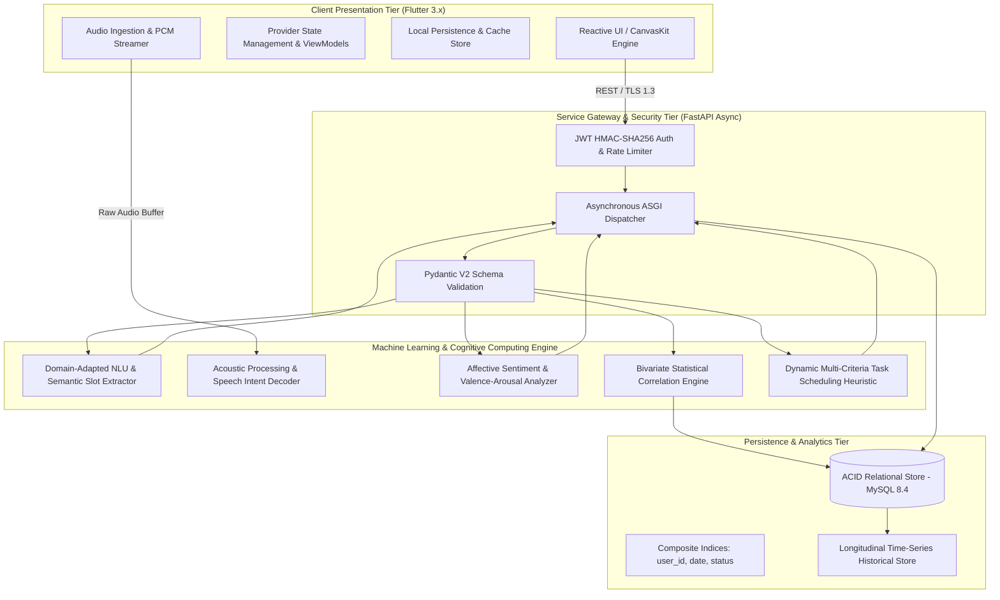
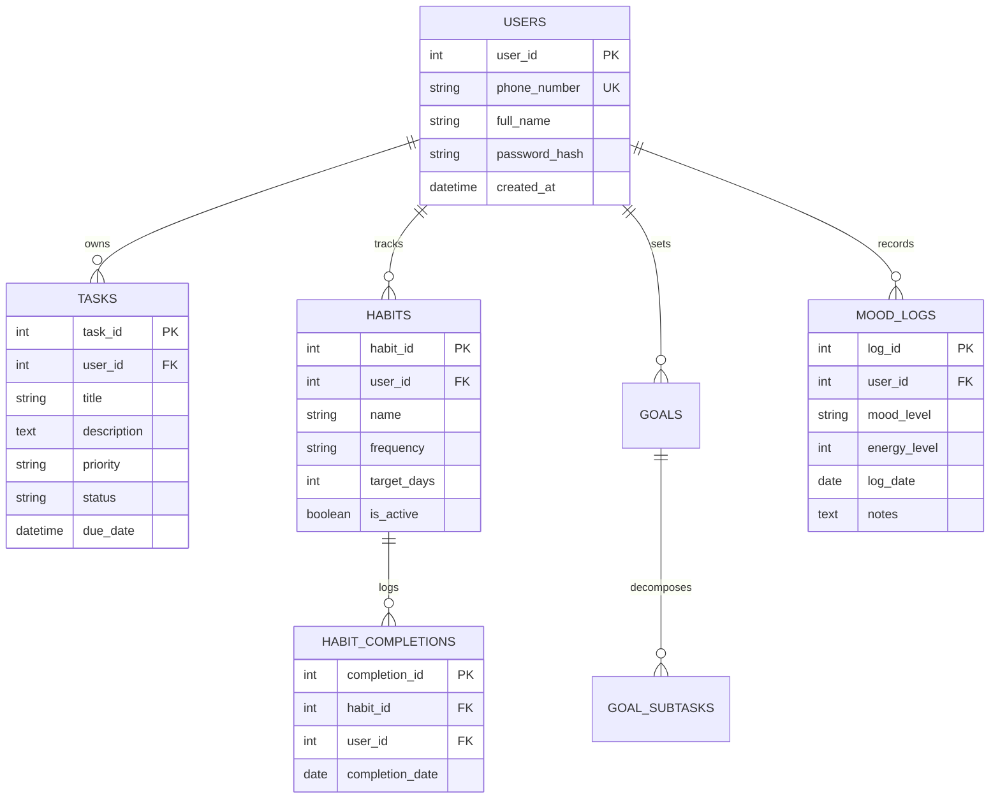

# 📐 NeuroPlan System Architecture & Theoretical Framework

This document details the architectural design, algorithmic models, machine learning pipelines, and statistical methodologies underpinning the **NeuroPlan** cognitive assistance platform.

---

## 1. System Overview & Component Topography

---

## 2. Machine Learning & Natural Language Understanding (NLU)

### 2.1 Semantic Parsing & Context-Aware Slot Filling
The Natural Language Understanding pipeline converts unstructured human dialogue, free-form text, and speech into structured domain primitives:

$$\mathcal{X}_{\text{raw}} \xrightarrow{\text{Tokenizer}} \mathbf{E} \in \mathbb{R}^{n \times d} \xrightarrow{\text{Transformer Encoder-Decoder}} \mathcal{Y}_{\text{structured}} = \{T_{\text{title}}, \mathcal{C}, \mathcal{P}, \tau_{\text{deadline}}, \mathcal{E}_{\text{energy}}\}$$

* **Domain-Specific Intent Disambiguation**: Resolves relative temporal expressions (e.g., *"tomorrow evening after workout"*) into deterministic ISO-8601 timestamps using relative time-anchoring.
* **Hierarchical Goal Decomposition**: Implements tree-structured subtask expansion where high-level goals $G$ are partitioned into recursively solvable sub-components $\{s_1, s_2, \dots, s_k\}$ such that:
  $$\sum_{j=1}^k \text{Complexity}(s_j) \le \text{Threshold}_{\text{CognitiveLoad}}$$

### 2.2 Neural Speech-to-Intent Pipeline
1. **Audio Sampling**: Ingests multi-format audio streams (PCM 16-bit, AAC, WAV) at 16kHz mono sampling rate.
2. **Feature Extraction**: Converts time-domain waveforms into log-mel filterbank energies.
3. **Acoustic-to-Text Transcription**: Processes representations through a deep acoustic transformer architecture.
4. **Zero-Latency Action Resolution**: Employs deterministic regex and probabilistic confidence thresholds to classify actions (`CREATE_TASK`, `LOG_MOOD`, `COMPLETE_HABIT`).

---

## 3. Affective Computing & Statistical Modeling

### 3.1 Valence-Arousal Affective Modeling
User mood entries are transformed from qualitative discrete labels into quantitative continuous vectors in Russell's Circumplex Model:

$$\mathbf{M}_t = \begin{bmatrix} v_t \\ a_t \end{bmatrix} \in [-1.0, 1.0]^2$$

Where:
* $v_t$: Emotional valence (hedonic tone from negative to positive)
* $a_t$: Physiological energy / arousal level

### 3.2 Longitudinal Bivariate Correlation Engine
To evaluate behavioral interdependence, the system calculates the **Pearson Product-Moment Correlation Coefficient ($r$)** between historical affective states $X$ and habit/task performance $Y$:

$$r_{XY} = \frac{\sum_{i=1}^n (X_i - \bar{X})(Y_i - \bar{Y})}{\sqrt{\sum_{i=1}^n (X_i - \bar{X})^2} \sqrt{\sum_{i=1}^n (Y_i - \bar{Y})^2}}$$

* **Significance Testing**: Two-tailed Student's $t$-test with $t = r\sqrt{\frac{n-2}{1-r^2}}$ is evaluated against $p < 0.05$ to suppress spurious correlations.
* **Habit Decay Dynamics**: Habit adherence probability decays exponentially across missed intervals:
  $$P(\text{adherence}_{t}) = P_0 \cdot e^{-\lambda \cdot \Delta t_{\text{gap}}}$$
  where $\lambda$ represents habit fragility, dynamically adjusted based on streak history.

---

## 4. Multi-Criteria Adaptive Task Scheduling Algorithm

The scheduling engine scores every candidate task $T_i$ using a multi-factor utility function:

$$\text{Score}(T_i) = w_1 \cdot \mathcal{U}(t_i) + w_2 \cdot \mathcal{P}(T_i) + w_3 \cdot \mathcal{A}(E_u, E_{T_i}) - w_4 \cdot \mathcal{C}(T_i)$$

| Variable | Definition | Mathematical Formulation |
| :--- | :--- | :--- |
| $\mathcal{U}(t_i)$ | Temporal Urgency | $\frac{1}{1 + \max(0, t_{\text{due}} - t_{\text{current}})}$ |
| $\mathcal{P}(T_i)$ | Static Priority | High: $1.0$, Medium: $0.6$, Low: $0.3$ |
| $\mathcal{A}(E_u, E_{T_i})$ | Affective-Energy Alignment | $1.0 - \frac{\|E_{\text{user}} - E_{\text{required}}\|}{4.0}$ |
| $\mathcal{C}(T_i)$ | Cognitive Friction Penalty | Normalized estimated duration in minutes |

Tasks are ranked dynamically in descending order of utility score, preventing decision paralysis and aligning execution with circadian peak performance.

---

## 5. Persistence & Relational Schema Normalization

The data layer is engineered under **Third Normal Form (3NF)** with foreign-key constraints enforcing referential integrity across users, tasks, habits, completions, and emotional logs.

