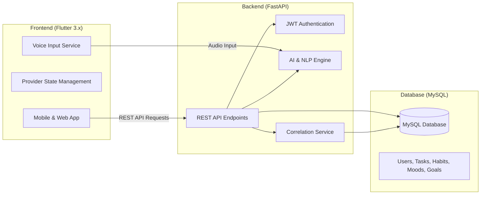

# 📅 AI-Powered Daily Planner & Habit Tracker

<div align="center">

[](https://www.python.org/)
[](https://fastapi.tiangolo.com/)
[](https://flutter.dev/)
[](https://github.com/mani828282/AI-Powered-Daily-Planner-and-Habit-Tracker)
[](https://www.mysql.com/)
[](LICENSE)

**A Bachelor of Science in Computer Science (BSCS) Final Year Project**  
*Developed by: Abdul Rehman*

[Features](#-key-features) • [AI & Machine Learning](#-ai--machine-learning-features) • [System Architecture](#-system-architecture) • [Quick Start](#-quick-start) • [Project Structure](#-project-structure)

</div>

---

## 📖 Overview

**AI-Powered Daily Planner and Habit Tracker** is an intelligent mobile and web application designed to help users organize their daily lives, build consistent habits, track goals, and understand their productivity patterns. 

Traditional to-do apps require repetitive manual entry and don't provide personalized feedback. This project integrates **Natural Language Processing (NLP)**, **Voice Recognition**, and **Machine Learning Correlation Analysis** to make planning faster, hands-free, and adaptive to user habits and daily energy levels.

---

## 🌟 Key Features

### 📋 Smart Task Management
* **Natural Language Task Creation**: Type naturally (e.g., *"Finish operating systems assignment by tomorrow 5 PM with high priority"*) and the AI extracts the title, due date, category, and priority automatically.
* **Auto-Prioritization**: Automatically categorizes tasks into High, Medium, or Low priority based on deadlines and task context.
* **Task Dashboard**: Clean overview of total, pending, and completed tasks with status filtering.

### 🎯 Habit Tracking & Streak Building
* **Streak Counter**: Visual streak indicators to motivate consistency.
* **Milestone Celebrations**: Encourages users at 7-day, 30-day, and 100-day milestones.
* **Habit Analytics**: Monitors completion rates over time to identify habit adherence.

### 🏆 AI Goal Breakdown
* **Smart Goal Decomposition**: Enter a large goal (e.g., *"Prepare for IELTS Exam"* or *"Launch a Flutter App"*), and the system automatically breaks it down into small, step-by-step actionable subtasks.
* **Progress Tracking**: Visual progress bars showing completion percentage as subtasks are marked done.

### 😊 Mood & Energy Correlation
* **Daily Mood Logging**: Quick logging of mood (Happy, Neutral, Stressed, Excited, Sad) and energy level (1 to 5).
* **Productivity Correlation**: The system analyzes how your mood and energy relate to your habit completion and task productivity.
* **Personalized Daily Insights**: Actionable recommendations based on past patterns.

### 🎙️ Hands-Free Voice Commands
* **Speech-to-Intent**: Speak your tasks or habit completions directly through your microphone. The voice engine transcribes your speech and creates tasks automatically without typing.

### 📅 Unified Calendar View
* View all your scheduled tasks, daily habits, and logged moods in a single interactive calendar.

---

## 🤖 AI & Machine Learning Features

The project incorporates practical machine learning and intelligent data processing:

```
                    ┌─────────────────────────┐
                    │  User Input (Text/Voice) │
                    └────────────┬────────────┘
                                 │
                 ┌───────────────┴───────────────┐
                 ▼                               ▼
     ┌───────────────────────┐       ┌───────────────────────┐
     │  Natural Language     │       │  Voice Recognition    │
     │  Processing (NLP)     │       │  (Speech-to-Text)     │
     │  - Intent Extraction  │       │  - Audio Parsing      │
     │  - Date/Priority Slot │       │  - Command Execution  │
     └───────────┬───────────┘       └───────────┬───────────┘
                 │                               │
                 └───────────────┬───────────────┘
                                 ▼
                     ┌───────────────────────┐
                     │   Structured Actions  │
                     │  (Tasks, Habits, etc) │
                     └───────────┬───────────┘
                                 │
                                 ▼
                     ┌───────────────────────┐
                     │   ML & Statistical    │
                     │  Correlation Engine   │
                     │  - Mood vs Habit      │
                     │  - Peak Energy Hours  │
                     │  - Personalized Tips  │
                     └───────────────────────┘
```

1. **Natural Language Understanding (NLP)**:
   - Parses unstructured text input into structured JSON containing `title`, `due_date`, `priority`, and `category`.
   - Handles relative date terms like *"tomorrow afternoon"*, *"next Monday"*, and *"in 3 hours"*.

2. **Speech Recognition Pipeline**:
   - Ingests audio input, transcribes spoken words, and extracts user intent to create tasks hands-free.

3. **Mood & Habit Correlation Analysis**:
   - Calculates statistical relationships between user-reported mood/energy levels and habit completion rates.
   - Generates data-driven insights (e.g., *"You complete 85% more habits on days when your energy is rated 4 or higher"*).

4. **Goal Decomposition Engine**:
   - Breaks down complex, long-term goals into a structured hierarchy of realistic milestones.

---

## 🏗️ System Architecture

The project follows a clean 3-tier architecture:



* **Frontend**: Cross-platform application built with **Flutter (Dart)** supporting Android, iOS, and Web.
* **Backend**: Asynchronous RESTful API built with **FastAPI (Python)** using Pydantic models for data validation.
* **Database**: Relational **MySQL** database with structured tables, foreign keys, and indexes for reliable data storage.
* **Security**: Password hashing with Bcrypt and stateless **JWT (JSON Web Token)** authentication.

---

## 🗄️ Database Structure

The database schema consists of clean, normalized tables:

* `users` - User profiles, phone numbers, and secure password hashes.
* `tasks` - Task titles, descriptions, due dates, priority levels, and completion status.
* `habits` - Habit names, target days, frequencies, and active statuses.
* `habit_completions` - Daily logs tracking when habits are marked done.
* `goals` & `goal_subtasks` - Long-term goals and their AI-generated subtasks.
* `mood_logs` - Daily mood logs, energy ratings (1-5), and personal reflections.

---

## 💻 Tech Stack

| Component | Technology | Purpose |
| :--- | :--- | :--- |
| **Frontend** | **Flutter 3.x / Dart** | Responsive UI for mobile and web with Provider state management |
| **Backend** | **Python 3.10+ / FastAPI** | High-speed asynchronous backend API |
| **AI / Machine Learning** | **Python NLP & ML Engine** | Natural language processing, voice transcription, pattern analysis |
| **Database** | **MySQL 8.0+** | Relational data persistence with foreign keys and indexes |
| **Authentication** | **JWT & Bcrypt** | Secure token-based user authentication |
| **Tools** | **Git, Uvicorn, Postman** | Version control, ASGI server, API testing |

---

## 📂 Project Structure

```
├── backend/                         # FastAPI Backend
│   ├── main.py                     # API routes and server setup
│   ├── config.py                   # App configuration & environment variables
│   ├── database.py                 # MySQL database connection
│   ├── auth.py                     # JWT token & authentication logic
│   ├── ai_service.py               # AI, NLP & goal decomposition service
│   ├── correlation_service.py      # Mood-habit statistical correlation service
│   ├── voice_service.py            # Voice processing & speech-to-intent
│   ├── models.py                   # Pydantic data schemas
│   └── requirements.txt            # Python dependencies
│
├── frontend_app/                   # Flutter Frontend
│   ├── lib/
│   │   ├── main.dart               # App entry point & theme
│   │   ├── config/                 # API configuration & routes
│   │   ├── models/                 # Data models (Task, Habit, Goal, Mood)
│   │   ├── services/               # API & voice service calls
│   │   ├── screens/                # UI screens (Dashboard, Tasks, Habits, Mood, Goals)
│   │   └── widgets/                # Reusable UI components
│   └── pubspec.yaml                # Flutter dependencies
│
├── database_setup.sql              # MySQL database schema setup
├── ai_planner_db.sql               # Full database structure
├── ARCHITECTURE.md                 # System design overview
├── QUICKSTART.md                   # Quick setup guide
└── README.md                       # Main documentation
```

---

## 🚀 Quick Start

### 1. Database Setup
1. Start MySQL (via XAMPP or MySQL Server).
2. Open phpMyAdmin or your MySQL terminal and run:
```sql
CREATE DATABASE ai_planner_db;
USE ai_planner_db;
SOURCE database_setup.sql;
```

### 2. Backend Setup
```bash
cd backend
python -m venv venv

# Activate virtual environment
# Windows:
venv\Scripts\activate
# Mac/Linux:
source venv/bin/activate

pip install -r requirements.txt
uvicorn main:app --reload --host 0.0.0.0 --port 8000
```
* **API Documentation**: [http://localhost:8000/docs](http://localhost:8000/docs)

### 3. Frontend Setup
```bash
cd frontend_app
flutter pub get

# Run on Chrome (Web):
flutter run -d chrome

# Or run on connected phone/emulator:
flutter run
```

---

## 🎯 Final Year Project (FYP) Details

* **Project Title**: AI-Powered Daily Planner and Habit Tracker
* **Degree**: Bachelor of Science in Computer Science (BSCS)
* **Author**: Abdul Rehman
* **Core Domains**: Mobile Application Development, Web Services, Applied Machine Learning, Natural Language Processing.

---

## 📜 License

This project is licensed under the MIT License - see the [LICENSE](LICENSE) file for details.
